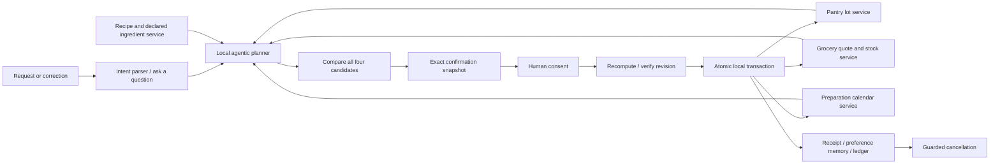

# TableReady architecture

## Tools and data

The application uses plain JavaScript modules and browser localStorage. `fixtures.js` authors the demo catalogue, pantry and recipes. `agent.js` exports pure domain functions. `app.js` calls those functions and shows their actual outputs in an inspectable trace.

The pantry service filters available lots by date, then sorts by label date. Candidate comparison scales recipe quantities to diners, allocates pantry quantities, rounds missing amounts to purchasable packs and checks catalogue stock. The calendar service detects interval overlap and insufficient lead time. The basket service produces an exact quote from the same catalogue revision. These service adapters are local simulations; their state transitions are implemented, not prerecorded animations.

## Choice policy

Hard constraints exclude candidates before ranking. Among eligible candidates the score is:

`nearDateLots × 20 + pantryCoverage × 0.5 − shoppingDollars × 0.8 − preparationMinutes × 0.15 + explicitRecipePreference × 100`

All terms are inspectable in `compareRecipes`. This policy is a product design choice for the demo, not a learned preference or validated measure of environmental benefit. A selected recipe that fails a hard constraint returns a question rather than silently substituting another dish.

## Consent and transaction

A plan stores the request, recipe, consumption amounts, pack quote, total, preparation interval and workspace revision. Its fingerprint is the canonical JSON representation of that snapshot. Confirmation recomputes the plan and compares both fingerprint and revision. It applies all mutations to a cloned workspace only after successful verification. Duplicate confirmation returns the stored receipt using the plan ID and changes nothing.

Catalogue updates increment the revision, invalidating any pending plan. Confirmation also recalculates time constraints, so a plan may become invalid even when its stored revision has not changed. A real service version would use adapter-specific ETags/quote IDs and a signed consent payload rather than a local JSON fingerprint.

## Reversal

A confirmed plan stores the prior pantry and catalogue. Automatic cancellation is allowed only before preparation and only while the confirmation remains the latest revision. It restores those values and retains cancelled order and calendar records. Later changes block reversal rather than overwriting newer work. Preference history remains as decision memory. Real supplier cancellation would need an independent compensating action and a response from the supplier.

## Persistence and security

One `tableready-workspace-v1` localStorage record holds quantities, receipts, calendar, preferences and ledger. Writes fail visibly to session-only mode. There are no credentials, third-party runtime calls or imported files. User strings are HTML escaped. This is a single-device prototype, so storage is not encrypted, account-scoped or tamper-proof. Production integration would require authenticated access, bounded adapter responses and server-side consent verification.
